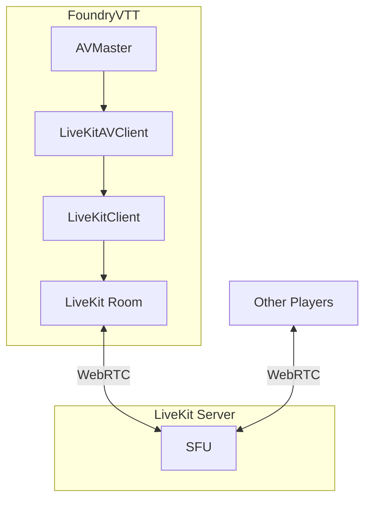
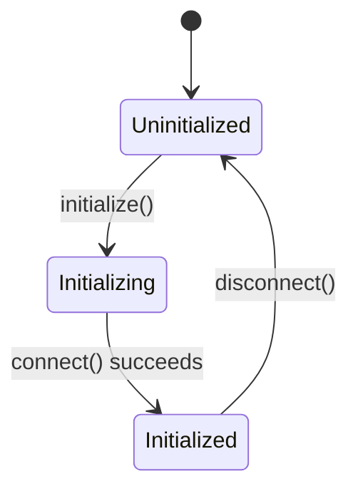
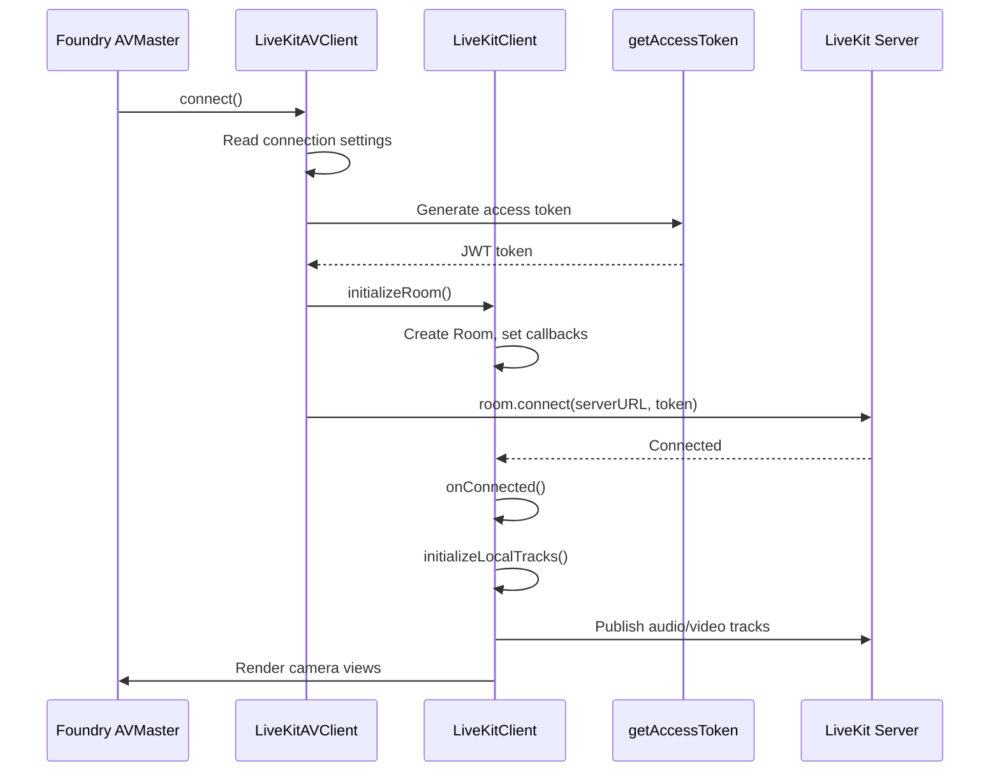

# Architecture

This document describes the internal architecture of the **LiveKit AVClient** module for FoundryVTT. It is intended for developers who want to understand the codebase, contribute to the project, or build integrations on top of it.

---

## High-Level Overview

The module replaces FoundryVTT's native WebRTC A/V system (SimplePeer / EasyRTC) with [LiveKit](https://livekit.io/), a Selective Forwarding Unit (SFU)–based real-time communication platform. Instead of each client maintaining peer-to-peer connections to every other user (mesh topology), all clients connect to a central LiveKit server that intelligently forwards audio and video tracks.

---

## Module Entry Point

The module bootstraps through two files:

| File | Purpose |
|------|---------|
| `avclient-livekit.js` | Dev-server shim — sets `window.global` and imports the TS entry point |
| `src/avclient-livekit.ts` | Production entry — imports hooks and sets `CONFIG.WebRTC.clientClass = LiveKitAVClient` |

The entry point does two things:

1. **Registers Foundry hooks** via `src/utils/hooks.ts` (init, ready, renderCameraViews, getUserContextOptions).
2. **Overrides** FoundryVTT's WebRTC client class so the engine uses `LiveKitAVClient` for all A/V operations.

---

## Core Modules

### `LiveKitAVClient` (`src/LiveKitAVClient.ts`)

**Role:** The Foundry-facing AVClient implementation. This class extends `AVClient` and provides the interface that FoundryVTT's `AVMaster` orchestrator calls.

**Key responsibilities:**

- **Lifecycle management:** `initialize()`, `connect()`, `disconnect()`
- **Device enumeration:** `getAudioSinks()`, `getAudioSources()`, `getVideoSources()` via `_getSourcesOfType()`
- **Track state:** `isAudioEnabled()`, `isVideoEnabled()`, `toggleAudio()`, `toggleVideo()`, `toggleBroadcast()`
- **User streams:** `getConnectedUsers()`, `getMediaStreamForUser()`, `getLevelsStreamForUser()`, `setUserVideo()`
- **Settings handling:** `onSettingsChanged()`, `updateLocalStream()`

**Connection flow in `connect()`:**

1. Determines the server type and retrieves connection settings.
2. Generates a JWT access token locally via `getAccessToken()`.
3. Creates and configures a LiveKit `Room` via `LiveKitClient`.
4. Connects to the LiveKit server with the token.
5. Publishes local audio/video tracks.
6. Fires `liveKitClientAvailable` and `liveKitClientInitialized` hooks.

---

### `LiveKitClient` (`src/LiveKitClient.ts`)

**Role:** The core LiveKit orchestrator. Manages the LiveKit `Room` object, handles room and participant lifecycles, and coordinates the Sub-Managers.

**Key responsibilities:**

- **Room management:** `initializeRoom()`, room event callbacks (`setRoomCallbacks()`)
- **Participant handling:** `addAllParticipants()`, `onParticipantConnected()`, `onParticipantDisconnected()`, `getParticipantFVTTUser()`
- **Event handling:** `onConnected()`, `onDisconnected()`, `onReconnecting()`, `onReconnected()`
- **Socket events:** `onSocketEvent()` — handles breakout, connect, disconnect, and render commands

**Initialization state machine:**

### `LiveKitTrackManager` (`src/LiveKitTrackManager.ts`)

**Role:** Media stream orchestrator. Responsible for spawning, managing, and mixing local and remote user tracks.

**Key responsibilities:**

- **Track management:** `initializeLocalTracks()`, `initializeAudioTrack()`, `initializeVideoTrack()`, `changeAudioSource()`, `changeVideoSource()`
- **Track attachment:** `attachAudioTrack()`, `attachVideoTrack()`, `getUserAudioTrack()`, `getUserVideoTrack()`
- **Track mixing:** `createMixedAudioTrack()`, `cleanupMixer()`
- **Audio configuration:** `getAudioParams()` with advanced tuning option, `trackPublishOptions()`
- **Screen sharing:** `shareScreen()`

### `LiveKitUIManager` (`src/LiveKitUIManager.ts`)

**Role:** The DOM presentation layer. Automates UI hooks into Foundry's standard web elements.

**Key responsibilities:**

- **UI elements:** `addConnectionButtons()`, `addConnectionQualityIndicator()`, `setConnectionQualityIndicator()`, `onRenderCameraViews()`
- **Interaction inputs:** Volume slider overrides, `onAudioPlaybackStatusChanged()`

---

### `LiveKitAVConfig` (`src/LiveKitAVConfig.ts`)

**Role:** Custom settings UI that replaces Foundry's default Audio/Video Configuration dialog.

**Key responsibilities:**

- Modifies the settings page to establish native integration forms for the Custom LiveKit server details.
- Exposes module-specific settings (connection quality, advanced modes, etc.) in a dedicated "LiveKit AVClient" tab.

**Templates used:**

| Template | Purpose |
|----------|---------|
| `templates/server.hbs` | Server configuration: custom URL/API key/secret fields |
| `templates/livekit.hbs` | Module-specific settings rendered as form groups |

---

### `LiveKitBreakout` (`src/LiveKitBreakout.ts`)

**Role:** Breakout room functionality — allows a GM to split the party into separate A/V sessions.

**Key functions:**

| Function | Purpose |
|----------|---------|
| `getBreakoutRoom(userId)` | Retrieve a user's current breakout room ID |
| `setBreakoutRoom(userId, breakoutRoom?)` | Store a breakout room assignment in module settings |
| `addContextOptions(contextOptions, liveKitClient)` | Add right-click context menu entries to the Players list |
| `breakout(breakoutRoom, liveKitClient)` | Switch the current user to a different breakout room |
| `_startBreakout(userId, breakoutRoom)` | GM-only: assign a user to a breakout room and notify via socket |
| `_endUserBreakout(userId)` | GM-only: remove a user from their breakout room |
| `_endAllBreakouts(liveKitClient)` | GM-only: end all active breakout rooms |

**Context menu options added:**

- Start A/V Breakout (GM → other user)
- Join A/V Breakout (GM → user already in a breakout)
- Pull to A/V Breakout (GM → pull user into GM's current breakout)
- Leave A/V Breakout (self)
- Remove from A/V Breakout (GM → other user)
- End All A/V Breakouts (GM)

Breakout rooms work by reconnecting to the LiveKit server with a different room name appended, and using Foundry's socket system to coordinate room assignments between clients.

---

## Utility Modules

### `utils/auth.ts`

Provides JWT token generation for LiveKit server authentication.

| Function | Description |
|----------|-------------|
| `getAccessToken()` | Creates a JWT locally using the `jose` library, signed with the configured API secret. |

### `utils/hooks.ts`

Registers all FoundryVTT hooks:

| Hook | Action |
|------|--------|
| `init` | Overrides voice modes (removes Activity Detection), registers module settings |
| `ready` | Sets up socket listener for inter-client messages, overrides the WebRTC settings menu with `LiveKitAVConfig` |
| `renderCameraViews` | Delegates to `LiveKitClient.onRenderCameraViews()` to inject custom UI elements |
| `getUserContextOptions` | Delegates to `LiveKitClient.onGetUserContextOptions()` to add breakout room options |

### `utils/registerModuleSettings.ts`

Registers all module settings with Foundry's settings API:

| Setting Key | Scope | Description |
|------------|-------|-------------|
| `displayConnectionQuality` | client | Show connection quality indicator dots |
| `liveKitConnectionSettings` | world | Server configuration parameters |
| `breakoutRoomRegistry` | client | Current breakout room assignments |
| `audioMusicMode` | client | Tune audio for music streaming |
| `useExternalAV` | client | Open A/V in a separate browser window |
| `resetRoom` | world | Generate a new room ID (GM-only trigger) |
| `debug` | world | Enable debug-level logging |
| `liveKitTrace` | world | Enable LiveKit SDK trace-level logging |
| `devMode` | world | Expose developer-only settings |
| `forceTurn` | world | Force TURN relay (dev mode only) |

### `utils/constants.ts`

Module-wide constants:

| Constant | Value |
|----------|-------|
| `MODULE_NAME` | `"avclient-livekit"` |
| `LANG_NAME` | `"LIVEKITAVCLIENT"` |

### `utils/helpers.ts`

General-purpose utilities:

| Export | Description |
|--------|-------------|
| `delayReload()` | Debounced (100ms) page reload |
| `debounceRender()` | Debounced (200ms) WebRTC render |
| `debounceRefreshView(userId)` | Debounced (200ms) per-user camera view refresh |
| `sleep(delay)` | Promise-based delay |
| `callWhenReady(fn)` | Execute immediately if game is ready, otherwise hook on `ready` |
| `deviceInfoToObject(list, kind)` | Convert device list to `{id: label}` map |

### `utils/logger.ts`

Logging wrapper using the [`debug`](https://www.npmjs.com/package/debug) library. Creates namespaced loggers at five levels: `TRACE`, `DEBUG`, `INFO`, `WARN`, `ERROR`. Each level maps to the corresponding `console.*` method. Logger namespaces follow the pattern `avclient-livekit:LEVEL:prefix`.

---

## Type Definitions

`types/avclient-livekit.d.ts` defines:

- **`LiveKitConnectionSettings`** — server connection parameters and credentials
- **`SocketMessage`** — inter-client socket message format (actions: breakout, connect, disconnect, render)
- **Global augmentations** — extends Foundry's `SettingConfig` with all module settings types

---

## Data Flow

### Connection Sequence

### Socket Communication

The module uses Foundry's socket system (`module.avclient-livekit`) for coordinating between clients:

| Action | Direction | Purpose |
|--------|-----------|---------|
| `breakout` | GM → Player | Assign/remove a player to/from a breakout room |
| `connect` | Any → All | Command all clients to reconnect |
| `disconnect` | Any → All | Command all clients to disconnect |
| `render` | Any → All | Command all clients to re-render camera views |

---

## Build System

The project uses **Vite** with the following configuration:

- **Entry:** `src/avclient-livekit.ts` → bundled as an ES module
- **Output:** `dist/` directory with sourcemaps
- **Base path:** `/modules/avclient-livekit/` (matching FoundryVTT's module directory structure)
- **Dev server:** Port 30001, proxying non-module requests to Foundry at port 30000
- **Plugins:**
  - `@vitejs/plugin-basic-ssl` — SSL for local development
  - `vite-plugin-checker` — ESLint + TypeScript checking during dev
  - `vite-plugin-static-copy` — Copies `module.json`, `README.md`, `CHANGELOG.md`, and `LICENSE*` to dist
  - Custom `write-to-disk` plugin — Syncs `public/` folder contents to `dist/` during dev

---

## Internationalization

The module supports three languages via JSON files in `public/lang/`:

- **English** (`en.json`)
- **Spanish** (`es.json`)
- **Polish** (`pl.json`)

All user-facing strings use the `LIVEKITAVCLIENT.*` localization namespace.

---

## CSS

`public/css/avclient-livekit.css` provides styles for:

- Connection quality indicator dots (excellent/good/poor/unknown)
- Remote user hide/mute status icons
- Push-to-talk status indicator
- Custom LiveKit control buttons
- Camera view layout fixes for FoundryVTT v13
